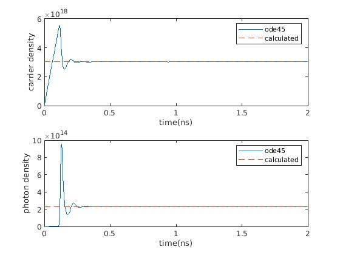
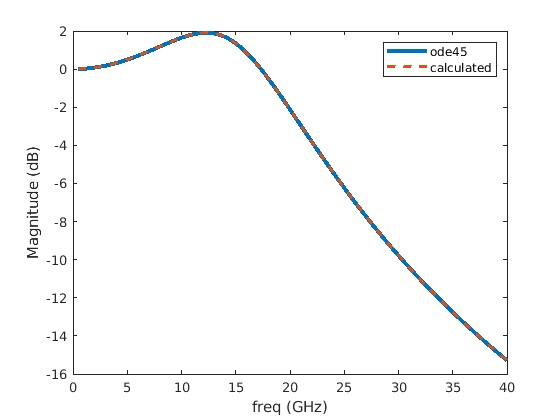

# Density Laser Rate Equation 

Carrier and photon density rate equations solved in MATLAB

## Features 

Able to extract laser parameters from measured and simulated data\ 
Rate equations are linearized in order to speed up calculations\ 

## Test Cases

test_rate_eqn_density.m - test case to ensure linearized and numerically solved set of rate equations match\ 

test_freq_resp.m - test case to ensure that the small signal frequency response for the linearized set of laser rate equations is equivalent to ode45\

test_param_extract_bw.m  test case to verify correct parameter extraction of laser frequency response\

test_PAM2.m - visual test case to inspect drive current and time domain characteristic when directly modulating lasers\
